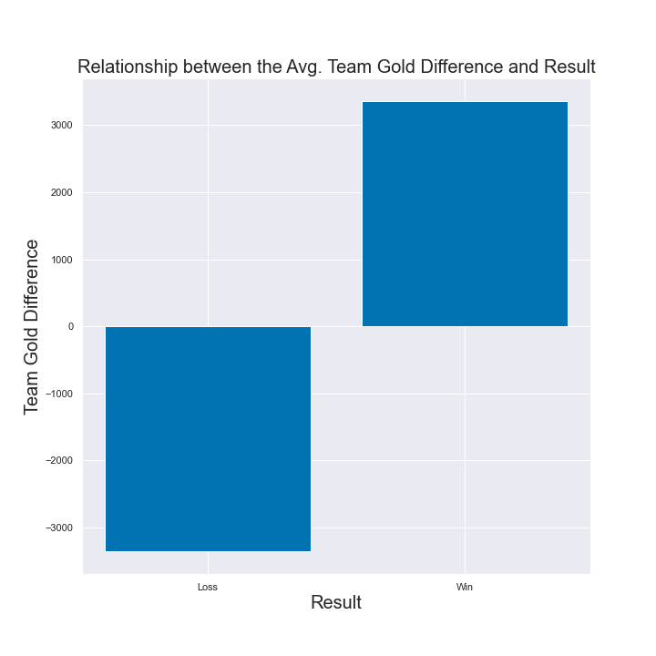
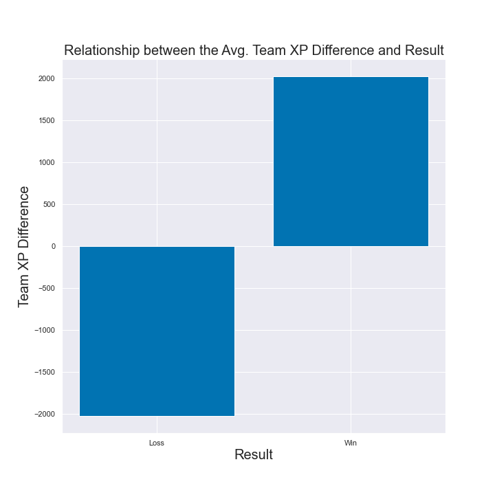
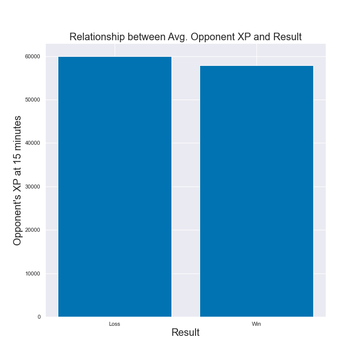

# League of Legends Game Prediction Project

**Authors**: [Vlad Sekiguchi](mailto:vlsekig@gmail.com)

## Overview

For this project, we compare the accuracy of predicting a win or a loss in a professional game of League of Legends between a dummy, logistic regression, and decision tree model.

## Business Problem
With all the information and statistics in a League of Legends game, how can we use that to help us make a prediction in a live game. Additionally, which are the most important statistics that we should be paying attention to? We provide these answers to Esports Edgeseekers.

## Data
This project uses 8,954 professional League of Legends game that were played in 2022. This data was provided by [Oracle's Elixir](https://oracleselixir.com/) and the csv data used was compiled and provided by [Jordi Pompas](https://www.kaggle.com/datasets/jordipompas/lolesports?resource=download). This dataset can be found in the general folder named as: 2022_LoL_esports_match_data_2022_07_25.csv.

## Methods
The data was cleaned to only include numerical values and the statistics of teams at the 15 minute mark. To analyze the data the accuracy of a dummy model that only picks the winning team was used as the baseline. The next steps were to implement a logistic regression model on the data, and then use a decision tree model to try to further accuracy/insight.

## Results

Examined 15 team statistics at the 15 minute mark:

    - Gold
    - XP
    - Creep Score
    - Opponent's Gold
    - Opponent's XP
    - Opponent's Creep Score
    - Gold difference
    - XP difference
    - Creep Score difference
    - Kills
    - Assists
    - Deaths
    - Opponent's Kills
    - Opponent's Assists
    - Opponent's Deaths
    
The decision tree model produced an accuracy score of 74.13%. Which means that out of the total testing data (wins and losses) the model has predicted 1512/1912 losses correctly, and 1309/1893 wins correctly. Below is a confusion matrix showing this.

## 1. Predictive Features and their importance
Shows the weighted importance of each predictive feature.

## 2. Relationship between Gold Difference and Results
Shows the relationship between teams Gold Difference and results.

## 3. Relationship between XP Difference and Results
Shows the relationship between teams XP Difference and results.

## 4. Relationship between Opponent's XP and Results
Shows the relationship between Opponent's team XP and results.

## Conclusion

In conclusion a 74% predictor would be absolutely fantastic in the world of esports betting. Being able to predict a loss or a win would be equally valid in a betting setting, as you can usually take either side. Having said that, this model would need to be put to the test and start generating live predictions to see how accurate it is in the wild.

## Next Steps
It's all sunshine and rainbows in theory, but the real juice comes from practice. A deeper analysis would be needed to further improve upon these results. I'd like to investigate the following features to iterate upon the current model: team names and leagues. Maybe some teams on average just transcend the statistics and come away with wins no matter what. Different teams belong to different leagues and just like the NBA is probably better than most other professional basketball leagues, maybe this too applies to League of Legends leagues.

## For More Information
See the full analysis in the [Jupyter Notebook]()

or review this [Presentation]()

